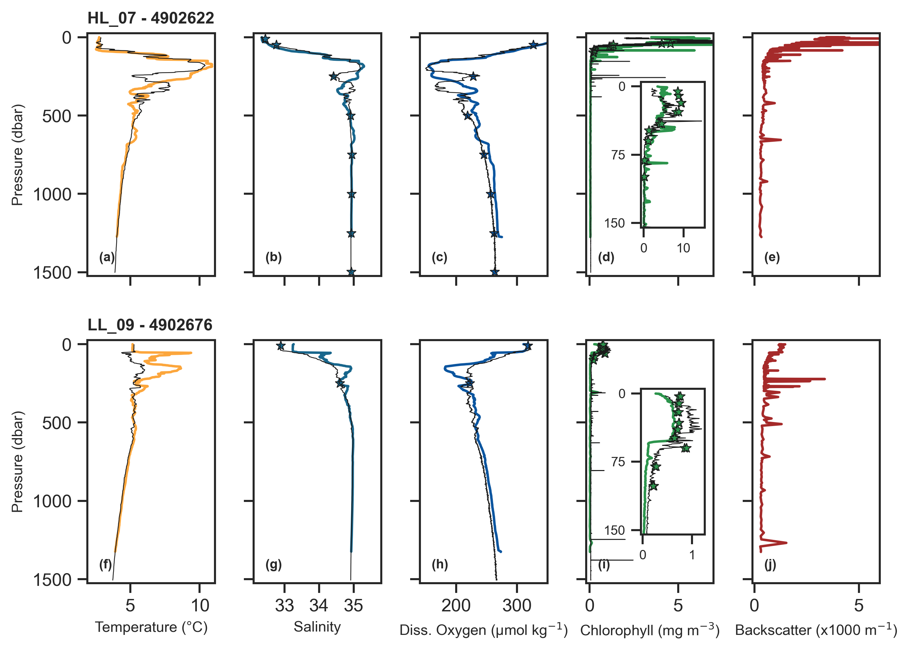
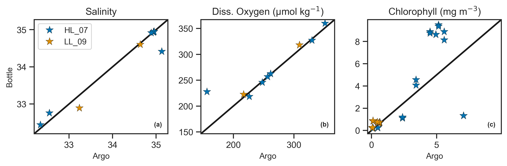

Two profiling Argo floats were deployed on AZMP stations HL_07 and LL_09, with WMO numbers 4902622 and 4902676 respectively (table [table ref]). The floats were NKE PROVOR floats equipped with a CTD, oxygen optode, an ECO sensor measuring chlorophyll and optical backscattering. These floats will record vertical profiles from 2000m to the surface every 10 days, with data being delivered and quality controlled in real time, openly available within 24 hours of its collection. The floats should survive for 5 years before their batteries are depleted.

<div class="layout-chunk" data-layout="l-body">

Table: (\#tab:table)Metadata associated with the Argo floats deployed during the Spring AZMP TEL2024880. The WMO and Serial Numbers of each float are provided along with the time and location of deployment.

|Station |Model  |Deployment Date |Deployment Time | Latitude| Longitude|     WMO|Serial Number  |
|:-------|:------|:---------------|:---------------|--------:|---------:|-------:|:--------------|
|HL_07   |PROVOR |2024-04-12      |20:42:00        |  43.4698|  -61.4349| 4902622|P41305-22CA003 |
|LL_09   |PROVOR |2024-04-27      |21:23:00        |  43.4721|  -57.5224| 4902676|P41305-23CA003 |

</div>


The first profile recorded by each float is shown in figure [fig 1 ref]. Comparison with analogous sensors on the shipboard CTD package are shown except for backscatter. For Salinity, Oxygen, and Chlorophyll, water samples are shown as well.

<div class="layout-chunk" data-layout="l-body">
<div class="figure">

<p class="caption">(\#fig:figure 1)Initial profile for Argo floats 4902622 and 4902676 deployed at stations HL_07 and LL_09 respectively. Solid coloured lines show float data, thin black lines show analogous sensor data from the shipboard CTD package, and stars show water sample data for salinity (autosal), oxygen (Winkler titrations), and chlorophyll (flourometry). Insets on the chlorophyll plots (d, i) show the surface layer.</p>
</div>

</div>


The CTD profiles were taken just before the time of deployment of the floats, however the first profile reported by the floats is about 2 days afterwards (the floats take about 2 days to sink to depth, and record their profile on the ascent). This will be important to keep in mind as we compare the CTD sensor data and water samples to the Argo measurements. 
In general, the float measurements align well with the CTD data. At both stations, temperature and salinity sensor data are well aligned across the two platforms in the surface and deep waters. We see divergence of the two data sets in the more dynamic parts of the water columns, which can likely be attributed to the temporal and spatial differences between the two. Salinity water samples are well aligned with the CTD data in all cases, and only greatly diverge from the Argo data in two places - in the mid depth at station HL_07 and at the surface of LL_09. At HL_07 there is a corresponding divergence in temperature and oxygen, so these are likely two different parcels of water being measured. For LL_09, The surface water measured by the CTD and water samples is fresher than the Argo profile at 10m depth.

The Argo oxygen data shown here is adjusted using a gain factor calculated by comparing the Argo surface data to the nearest available surface data in the World Ocean Atlas, as described by [Bittig et al. (2018)]. Argo dissolved oxygen sensor data is very well aligned with the Winkler titration data, with the only major exception being where we see a large divergence in temperature data as well. This is shown more directly in figure [fig 2 ref] where scatter plots of Argo vs. bottle data can be seen for Salinity, Oxygen, and Chlorophyll. 

<div class="layout-chunk" data-layout="l-body">
<div class="figure">

<p class="caption">(\#fig:figure 2)Comparison of Argo sensor data with water samples.</p>
</div>

</div>


While the Argo data and chlorophyll fluorometer bottle data do not quantitatively line up particularly well, it is encouraging that the general structure of the profile is agreed upon between the two measurements. Despite best efforts, the manufacturer provided conversion factor between fluorescence and pigment concentration is variable [Roesler et al. (2017)] and absolute values should be considered carefully. We do see agreement across all measurement platforms of high surface chlorophyll on the Halifax line and comparatively lower concentration on the Louisbourg line. 
```{.r .distill-force-highlighting-css}
```
